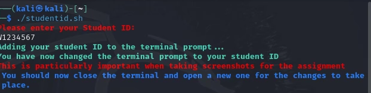

# Wireless Security Lab Environment
**Academic Year:** 2025–2026

---

## Kali Linux as a VM

> **PLEASE READ THIS SECTION CAREFULLY BEFORE YOU START**

For this module we will be using the Kali Linux machine as the attacker machine

- You can set up the lab environment either on your own device or using a lab machine.
- To set up the lab environment on the university lab machines, go to [Compatible Wireless Adapters for Monitor Mode](#compatible-wireless-adapters-for-monitor-mode)
- To set up the lab environment on your own machine, go to [Compatible Wireless Adapters for Monitor Mode](#compatible-wireless-adapters-for-monitor-mode)
- You will need to obtain **special Wireless Cards** for this.
- In some activities, you will need two Linux VMs — one to act as an AP and another to act as the attacker. Your host machine can still run as a client.
- Unless you have full access to a spare wireless router, you will need two **Wireless cards** to complete some activities — one for a machine acting as an access point, and one for a machine acting as the attacker. For the client, you can use your own host interface.
- Not all wireless cards will work. To see a list of supported adapters, please see [Compatible Wireless Adapters for Monitor Mode](#compatible-wireless-adapters-for-monitor-mode)
- On your own device: if installed correctly, you will need to complete this lab only once.
- In a lab room: use the preconfigured lab setup.
- Once you complete the VM setup, continue to the network configuration section.
- If you are having a problem, refer to the troubleshooting section.

### Setting up the lab environment on your own machine

- You must have administrator privileges to install software. You will need the following:
  - [VMWare](https://support.cse.westminster.ac.uk/w/index.php/VMWare) — virtualisation software used to manage the VMs.
  - [7zip](https://www.7-zip.org/download.html) — used to unpack the module VMs.
  - If downloading from home, connect to the university VPN. Instructions: [University IT Support VPN Guide](https://servicedesk.westminster.ac.uk/support/solutions/articles/51000007428)

- The main VM used in this module is Kali Linux. This acts as the attacker or penetration tester machine and includes preinstalled tools configured for this module.
  - Use the **university-provided** Kali image: `kali-linux-2025.2-vmware-amd64-UoW-25-08-06-VMware`
  - This image is different from the standard one found on the official Kali website.

- Download links:
  - From home: [https://download.cse.westminster.ac.uk/VirtualMachines/](https://download.cse.westminster.ac.uk/VirtualMachines/)
  - On Eduroam: [http://10.20.144.78/download/VMs/](http://10.20.144.78/download/VMs/)
  - Save the VM in a directory with sufficient space (e.g. `VMs` folder)
 
## Problems You May Encounter

**Common issues on personal machines:**

- VM won’t start:
  - Free up disk space
  - Enable virtualisation in BIOS ([Enable on Windows](https://support.microsoft.com/en-us/windows/enable-virtualisation-on-windows-11-pcs-c5578302-6e43-4b4b-a449-8ced115f58e1))
- Missing host-only adapter: create it in VirtualBox preferences
- USB device not detected: try USB 1.1 setting in VM config
- Network doesn't update: run `sudo dhclient`
- On macOS: [build instructions here](https://support.cse.westminster.ac.uk/w/index.php/VMWare)

---

## Dealing with the VM Files

The Virtual Machines should already be in `C:\VirtualMachines` in 7z format on lab machines. Do not delete these files.

If missing, download from:

- CLG.43: [http://192.168.143.203/download](http://192.168.143.203/download)
- CLG.45: [http://192.168.145.206/download](http://192.168.145.206/download)
- Eduroam or any other lab: [http://10.20.144.78/download/VMs/](http://10.20.144.78/download/VMs/)

---

## Unpacking the VMs

- Extract the `.7z` files using 7zip.
  - Right-click the archive kali-linux-2025.2-vmware-amd64-UoW-25-08-06-VMware → 7zip → **Extract Here**
  - On the university machine: 
    - You must extract to `C:\VirtualMachines` 
    - On your own machine, you can extract it to any folder with enough space.
---

## starting up VMWare

- Start VMWare.
  - If VMs already appear, it's safe to remove them: Right-click → Remove 
  - The `.7z` files remain and can be extracted again to start fresh.

## Deploying Kali Linux VM on VMWare

- Start VMWare.
  - If VMs already appear, it's safe to remove them: Right-click → Remove 
  - Deleting the VM and its folder will allow you to start from screen state. This is important if another student was using the VM before you. 
- Click on `File` → Open` → and browse the Kai linux extracted folder
  - Select the file `kali-linux-2025.2-vmware-amd64.vmx` and click `Open`

<figure>
  
  <figcaption><em>Figure: Deploy Kali Linux</em></figcaption>
</figure>

- The Kali Linux machine should be deployed now and you should be able to see it on the list of VMs bar to the left.

<figure>
  
  <figcaption><em>Figure: Deployed Kali Linux</em></figcaption>
</figure>

## Start the VMs

To start the VM:
- Double-click the VM, or select and click **Start**
- Log in with the credentials below

**Kali Linux VM Credentials:**
- Username: `kali`
- Password: `kali`

---

## User Terminal

**IMPORTANT: Screenshots without your student ID will receive zero.**

To set your ID in the prompt:

```bash
cd /home/kali/
./studentid.sh
```
or 
```bash
cd ~
./studentid.sh
```
- Enter your ID when prompted
- Close and reopen the terminal
- Your ID should now appear in the prompt

<div id="studentid-script"></div>

<p align="center">
  
  
<figcaption style="font-size: 0.9em; text-align: center; margin-top: 5px;">
  <strong>Figure 1:</strong> Terminal showing student ID in prompt.
</figcaption>
</p>

## Network Connectivity

- Kali may require Internet access to install tools or retrieve updates — it's safe to allow Internet access.
- The lab access points should always be isolated from the Internet — especially when using vulnerable configurations.

---

## Compatible Wireless Adapters for Monitor Mode

To perform wireless attacks and capture packets, your adapter must support **monitor mode** and **packet injection**. Most built-in adapters do not.

**Recommended adapters:**
- Alfa AWUS036NHA — Atheros chipset, 2.4 GHz
- Alfa AWUS036ACH — Dual-band, works well for WPA2 labs
- TP-Link TL-WN722N **v1** — only version 1 supports monitor mode
- Panda PAU06 / PAU09 — good compatibility, USB 2.0

**Avoid:** TL-WN722N v2/v3 (Realtek chipsets — no monitor mode)

To list interfaces:

```bash
iw dev
```
<figure>
  
  <figcaption><em>Figure: Check AP connected</em></figcaption>
</figure>

- Look for names like `wlx*` or `wlan0` (USB adapter)
- Interfaces with "no wireless extensions" are not usable


## Understanding Network Connections in Virtual Machines

Kali VM has two interfaces:

- `eth0` — NAT for Internet access (default)
- `wlan0` — USB wireless interface for lab scanning and attacks

VMWare setup:
1. Select your VM → **Settings**
2. Go to **Network Adapter**
3. Choose **NAT** if Internet access is needed
4. Choose **Host-only Adapter** for isolation
5. Click **OK** to apply

```
                 Internet ────────────────┐ 
                        │                │
         ┌──────────────▼────────────┐   │
         │    Host Machine           │   │
         │ (Laptop / Lab PC)         │   │
         │                           │   │
         │   USB Wi-Fi Adapter       │   │
         └──────────────┬────────────┘   │
                        │ USB passthrough│
                ┌───────▼─────────┐      │
                │ Virtual Machine │      │
                │  (Kali Linux)   │─────▶│ eth0 - NAT
                └───┬─────────────┘      │
                    │                    │
            ┌───────▼──────────┐         │
            │ lab-wlan (Wi-Fi) │─────────┘
            └──────────────────┘
```

---

<figure>
  
  <figcaption><em>Figure: VM Network settings</em></figcaption>
</figure>

---
---

## Connecting to the Network and Running an Access Point

In this section, you will learn how to:

- Verify wireless interfaces and IP configuration  
- Scan and connect to a visible access point  
- Tear down any temporary configuration  

---

### Checking Wireless Interfaces and IP Addresses

```bash
ip a
```

Look for:
- `eth0` — NAT interface
- `lab-wlan` — external USB adapter
- Assigned IPs: e.g. `192.168.140.x`

To check routing:

```bash
ip r
```

To test Internet connectivity (for NAT interface):

```bash
ping -c 4 8.8.8.8
```

---

### Detecting the Access Point from Kali

```bash
sudo iw dev lab-wlan scan | grep SSID
```

Expected output:
```
SSID: 6CSEF005W-AP
```

If not shown:

```bash
sudo ip link set lab-wlan up
```

---

### Connecting to the Access Point

```bash
nmcli dev wifi connect 6CSEF005W-AP ifname lab-wlan
```

Then:

```bash
ip a show lab-wlan
```

Expected IP: `192.168.140.x`

---

## ✅ Summary

At this stage, your lab environment is fully operational:

- The USB adapter is functional as `wlan0`
- Kali can detect and connect to access points
- All interfaces are correctly configured

---

© Dr Ayman El Hajjar – University of Westminster  
For academic use only.
